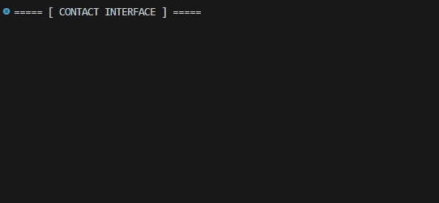

<p align="center">
  
</p>

# Turning Chaos into Code

This repository is a systematic log of my journey through software engineering and logic. 
It serves as a laboratory where I transform complex ideas and creative chaos into structured, functional code.

## 🛠 Tech Stack
- **Python**: Focused on automation, design logic, and data structure.
- **Future modules**: Planned expansions for web and creative coding.

## 📂 Organization
- **/python**: All Python-related development.
  - `core-projects`: End-to-end applications and refined solutions.
  - `daily-challenges`: Consistent practice with AI-evaluated logic.
  - `raw-sketches`: Early stage concepts and experimental scripts.

---

> *"Design is not just what it looks like and feels like. Design is how it works."*

```python
# Code truncated for readability and aesthetic purposes <<
MY_DATA = {
    "LinkedIn": {"value": "in/kauanhorvath", "action": "know_more"},
    "Instagram": {"value": "@Just_Horvath", "action": "take_a_look"},
    "E-mail": {"value": "kauanhorvath1996@gmail.com", "action": "send_proposal"},
    "Whatsapp": {"value": "+55 11 95491-0195", "action": "send_a_zapzap"}
}

def typewriter_effect(text, delay=0.04):
    for char in text:
        sys.stdout.write(char)
        sys.stdout.flush()
        time.sleep(delay)
    print()

def start_hiring_process(data_source: dict):
    print("===== [ CONTACT INTERFACE ] =====\n")
    time.sleep(0.5)
    typewriter_effect("Initializing protocol...", 0.08)
    print("-" * 33)
    time.sleep(0.5)

    for platform, info in data_source.items():
        url = info["value"].strip()
        func_name = info["action"]
        # Exibe a "chamada de função" simulada
        typewriter_effect(f"{func_name}('{url}')", 0.03)
        time.sleep(0.4)
    print("-" * 33)

if __name__ == "__main__":
    os.system("cls" if os.name == "nt" else "clear")
        
    start_hiring_process(MY_DATA)
        
    final_messages = [
        "\nLooking for a junior developer?",
        "I'm ready to turn logic into visual stories.",
        "Looking forward to hearing from you!\n"
    ]

    for msg in final_messages:
        typewriter_effect(msg, 0.05)
        time.sleep(0.8)
```
<p align="center">
  
</p>
